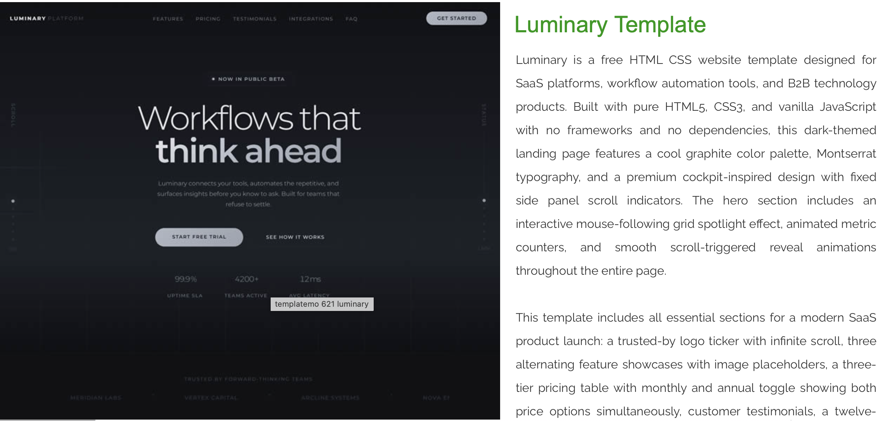
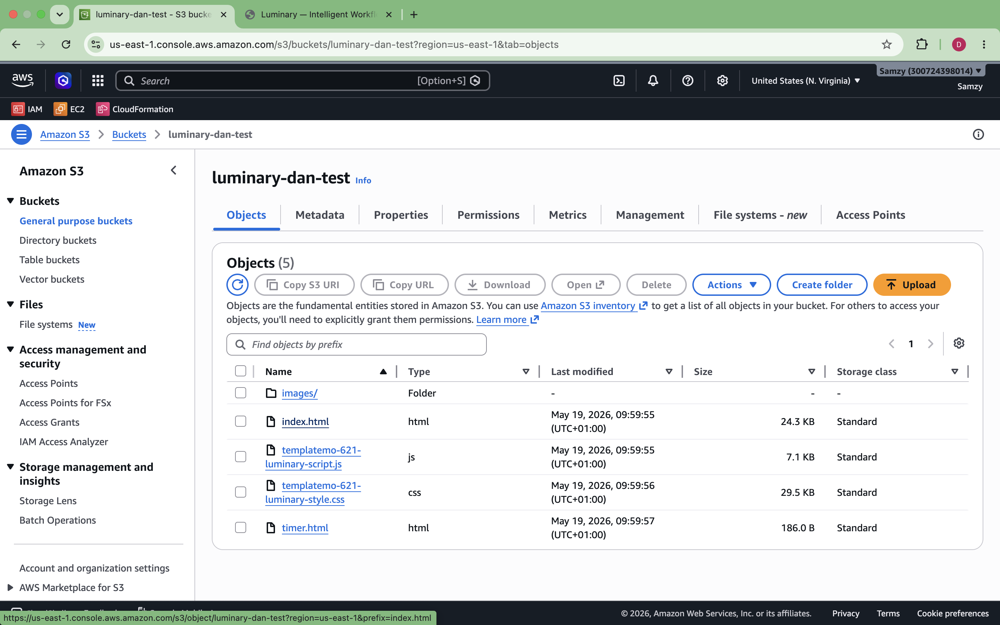
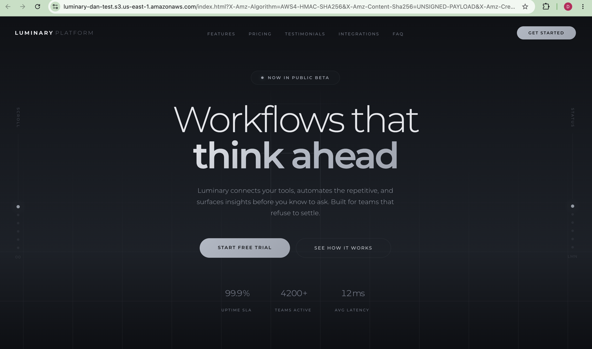

# **HOSTING A STATIC WEBSITE ON AWS USING AMAZON S3**
#### *(A concise recap of the step-by-step procedure of hosting a static website on AWS with the Amazon s3 service.)*
##

**Tools and Services used** 

1. AWS console itself. 
2. Amazon S3 bucket
3. [templatemo](templatemo.com) (provides the files for the demo site)
##

To fully understand this exercise, it is essential to first define some key terms and ensure understanding of them. 

* **A Static Website**: This is, in very simple terms, a website that is made up of files that are delivered to users exactly as they are stored. This means you basically cannot input command(s) to give you unique results other than what is already on the website. Some common examples are; landing pages, a blog’s homepage, a company’s information page, etc. 

* **Hosting: Hosting is simply “storing and serving”. You keep your files in a storage locker on your computer so anybody with the web address can access and view it when requested.**

Having understood these concepts, I shall now be explaining how to properly go about the process of hosting in itself.
##
To begin with, we will need to access [templatemo](templatemo.com) to download the web files of the site we intend to host. There are a couple of options to select from. After downloading, the files would automatically be presented in a ZIP format and for the purpose of this exercise, they would have to be unzipped (extract the internal files).

##
**Operating and Configuring the S3 buckets.**

At this point, you should be logged into the AWS console via your IAM user. Follow the next steps religiously 

1. Navigate to the S3 service and create a bucket. The bucket name should be a globally unique one so you could add your ARN to ensure this or just tweak it in a unique way. After choosing a name, scroll all the way down to unblock public access. This is to ensure that the site is accessible to the public.

2. Now that the bucket is created, you want to go to the bucket itself and select ‘Properties’. Under this section, scroll to the very end till you see “Static web hosting”. Select edit and then enable the feature. Still under this menu, you’d see sections for ‘index.html’ & ‘error.html’. Type in “index.html” in both fields and save then close the menu. 
3. The next thing to do is to add the bucket policy. The policy can be gotten online or from the AWS docs directly. Head to ‘Permissions’ under the created bucket menu and then select ‘bucket policy’. Select ‘edit’ beside the bucket policy menu and paste in the policy you’ve already copied. DO NOT forget to edit the bucket name in the policy you copied and replace with your own bucket name and then save. 

The S3 bucket has now been configured and is ready to host the website which leads us to our next set of steps — uploading the web files.
##
This is the next thing to do after correctly creating and configuring our buckets to ensure proper hosting of the website. 

**Uploading the Web Files;**

Here, we’d be making use of the files we downloaded at the start of this exercise from templatemo

1. Make sure you’re still within the bucket you created earlier but now, you’d select ‘Objects’. Under ‘Objects’, click the option to add either files or folder and then upload from your directory, the web files we downloaded earlier. They should contain items like ‘index.html’, ‘style.css’, etc. 

2. After selecting the files, you need to mark them and then actually upload to the S3 bucket. Doing this means the web files are now stored as objects in the bucket with the policies and permissions we granted earlier for the purpose of hosting. At this point, everything is basically ready but we just need to crosscheck.

3. To do that, head back into objects, under the files uploaded, select ‘index.html’ only and then open directly from the AWS console. You should now be redirected to a fully constructed static website and not just files and folders like we initially downloaded. 

And with that, we’ve practically succeeded in hosting a static website on AWS using the Amazon S3.

